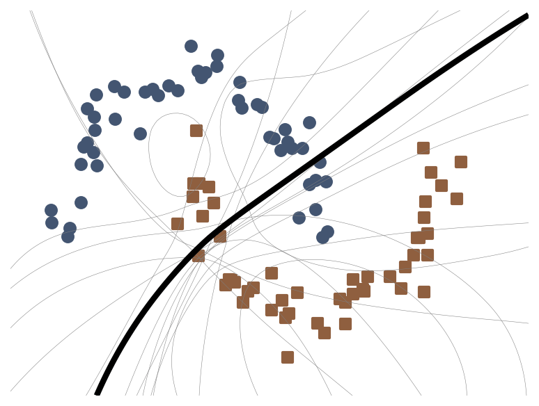

# bayesian-sam
Code for [SAM as an Optimal Relaxation of Bayes](https://arxiv.org/abs/2210.01620),
T. Moellenhoff, M. E. Khan, ICLR 2023. 

## installation and requirements
The code requires [JAX](https://github.com/google/jax) and various other standard dependencies such as matplotlib and numpy; see the 'requirements.txt'. 

To train on TinyImageNet, you will need to download the dataset from [here](http://cs231n.stanford.edu/tiny-imagenet-200.zip) and extract it into the datasetfolder directory (see the 'data.py' file). 

If you have `wget` installed, you can download the dataset via
```
wget http://cs231n.stanford.edu/tiny-imagenet-200.zip
```

## examples

### ResNet-18 on CIFAR-10
**SGD:**
```
python3 train.py --alpha 0.03 --beta1 0.9 --priorprec 25 --optim sgd --dataset cifar10
```
This should train to around ~94.8% test-accuracy. 

**SAM-SGD:**
```
python3 train.py --alpha 0.03 --beta1 0.9 --priorprec 25 --rho 0.05 --batchsplit 8 --optim sam --dataset cifar10
```
This should train to around ~95.7% test-accuracy. 

**bSAM:**
```
python3 train.py --alpha 0.5 --beta1 0.9 --beta2 0.999 --priorprec 40 --rho 0.01 --batchsplit 8 --optim bsam --dataset cifar10 --dafactor 4
```
This should train to around ~96% test-accuracy. 

To test our trained models and evaluate nll, ECE and AUROC we can use the following commands: 
```
python3 test.py --resultsfolder results/cifar10_resnet18/sgd/run_0 
python3 test.py --resultsfolder results/cifar10_resnet18/sam/run_0 
python3 test.py --resultsfolder results/cifar10_resnet18/bsam/run_0 --testmc 32
```
This should produce around the following results  
* SGD: testacc=94.77%, nll=0.2058, ece=0.0306, auroc=0.9336
* SAM: testacc=95.69%, nll=0.1431, ece=0.0134, auroc=0.9468
* bSAM: testacc=95.95%, nll=0.1239, ece=0.0082, auroc=0.9536

### ResNet-18 on CIFAR-100
Similary, we can train on other datasets; here is for example bSAM on CIFAR-100:
```
python3 train.py --alpha 0.5 --beta1 0.9 --beta2 0.999 --priorprec 40 --rho 0.01 --batchsplit 8 --optim bsam --dataset cifar100 --dafactor 4
```
The run should converge to around ~80.4% test accuracy. 

### ResNet-20 on TinyImageNet
To train on TinyImageNet, download the dataset using the link given above. Then extract the zip-File into the datasets directory and run 
```
python3 setup_tinyimagenet.py
```

Now, to train **SGD** on TinyImageNet we use:
```
python3 train.py --alpha 0.1 --beta1 0.95 --priorprec 20 --optim sgd --dataset tinyimagenet --model resnet20
```
This should train to around ~52.2% test-accuracy. 

**SAM-SGD:**
```
python3 train.py --alpha 0.1 --beta1 0.95 --priorprec 20 --rho 0.01 --batchsplit 8 --optim sam --dataset tinyimagenet --model resnet20
```
This should train to around ~52.4% test-accuracy. 

**bSAM:**
```
python3 train.py --alpha 0.25 --beta1 0.9 --beta2 0.999 --priorprec 25 --rho 5e-5 --batchsplit 8 --optim bsam --dataset tinyimagenet --model resnet20 
```
This should train to around ~53.5% test-accuracy. 

To test the trained models, we can run:
```
python3 test.py --resultsfolder results/tinyimagenet_resnet20/sgd/run_0 
python3 test.py --resultsfolder results/tinyimagenet_resnet20/sam/run_0 
python3 test.py --resultsfolder results/tinyimagenet_resnet20/bsam/run_0 --testmc 32
```
This should produce around the following results  
* SGD: testacc=52.28%, nll=2.0077, ece=0.0452, auroc=0.8316
* SAM: testacc=52.39%, nll=1.9961, ece=0.0317, auroc=0.8304
* bSAM: testacc=53.37%, nll=1.9594, ece=0.0206, auroc=0.8272

### illustrative 2D example


To illustrate bSAM on the above simple 2D example, run the code
```
python3 demo2d.py 
```

This script saves a file  `animation.gif`, which is the animiation shown above. 

## troubleshooting

Please contact [Thomas](thomas.moellenhoff@riken.jp) if there are issues or quesitons about the code, or raise an issue here in this github repository.